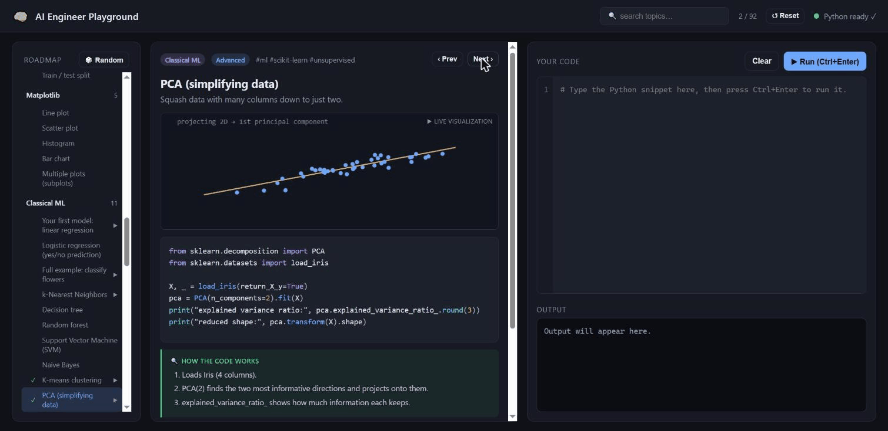

# 🧠 AI Engineer Playground — New Tab

A Chrome extension that turns **every new tab** into an AI-engineer prep
session. It ships a **90+ snippet curriculum** across 13 topic areas, a
**roadmap sidebar** to study by topic (with progress tracking), a code editor
with **syntax highlighting**, and **real Python in your browser** — `numpy`,
`scipy`, `pandas`, `scikit-learn` — all bundled locally.

Written for an **absolute beginner who knows Python**: every term is defined in
plain English, advanced topics are flagged "skim now, return later", and a
**Start Here** lesson lays out the learning path.



## Curriculum (90+ topics)

| Area | Covers |
|------|--------|
| **Python** | comprehensions, dicts/sets, args/kwargs, OOP, generators, decorators, functional, context managers |
| **Algorithms & DS** | bubble/merge sort, binary search, recursion + memoization, DP, stack/queue, tree traversal, hashing |
| **Math for ML** | vectors & dot product, matrix mult, linear systems, eigen, gradients, Bayes, distributions, stats, t-tests, correlation |
| **NumPy** | creating arrays, element-wise math, random numbers, broadcasting, masks, vectorization, reshaping, joining |
| **Pandas & Data** | groupby, missing data, joins, scaling, one-hot, train/test split |
| **Matplotlib** | line / scatter / histogram / bar charts, subplots — **plots render live** in the output |
| **Classical ML** | linear/logistic regression, KNN, decision tree, random forest, SVM, naive Bayes, k-means, PCA, gradient boosting |
| **Evaluation** | cross-validation, confusion matrix, ROC/AUC, regularization, regression metrics |
| **Neural Networks** | perceptron, activations, softmax, forward pass, **backprop from scratch**, gradient descent, cross-entropy |
| **PyTorch** 📖 | tensors, autograd, nn.Module, the training loop |
| **TensorFlow** 📖 | tensors, Keras models, compile/fit, predict |
| **NLP & LLM** | tokenization, bag-of-words, TF-IDF, embeddings & cosine, **self-attention from scratch**, positional encoding, **RAG retrieval**, temperature sampling |
| **MLOps** | model save/load, pipelines, reproducibility, data validation |

Most topics run in the browser via Pyodide. Deep-learning concepts (backprop,
attention) are implemented **from scratch in NumPy** — the best way to truly
understand them. **Matplotlib plots render for real** — the extension bundles
Matplotlib, runs it on a headless backend, and shows each figure as an image in
the output. The **📖 read-only** areas (PyTorch, TensorFlow) can't run in the
WASM sandbox, so they're reference lessons: full code + beginner explanations.
Pressing **Run** on one shows a friendly note pointing you to a free
[Google Colab](https://colab.research.google.com) notebook to try it for real.

## How it works

- **New-tab override** — opening a blank tab shows the playground.
- **Animated visualization per snippet** — each snippet has a looping
  canvas animation illustrating the concept (bubble sort swapping bars, binary
  search narrowing, gradient descent fitting a line, k-means centroids moving,
  kNN voting, …). Pure JS/Canvas, so it runs instantly without Python.
- **Real Python via [Pyodide](https://pyodide.org)** — CPython compiled to
  WebAssembly. No server, no Python install needed.
- **AI/ML libraries** — when your code does `import numpy` / `pandas` /
  `sklearn`, the runtime loads that package from the local bundle on the fly.
- **Runs in the new-tab page** — Pyodide loads directly in the page using the
  `'wasm-unsafe-eval'` CSP that Manifest V3 allows for extension pages. (No
  sandbox iframe: MV3 forbids `allow-same-origin` in the sandbox CSP, which
  would give the page an opaque origin and break Pyodide's storage + local file
  loading.)

## Install (load unpacked)

**1. Clone and download the Python runtime.** The bundled Pyodide runtime + ML
wheels (~145 MB of binaries) are *not* committed to git — fetch them once with
the included script (needs [Node.js](https://nodejs.org) 18+):

```bash
git clone https://github.com/prappo/ml-learning-extension.git
cd ml-learning-extension
node scripts/fetch-pyodide.mjs        # downloads ./pyodide (~145 MB)
```

**2. Load it into Chrome:**

1. Open `chrome://extensions`.
2. Turn on **Developer mode** (top-right toggle).
3. Click **Load unpacked** and select the `ml-learning-extension` folder.
4. Open a **new tab** — the playground appears.

> Chrome only allows **one** new-tab extension at a time. If another one is
> installed it will ask which to use / you may need to disable the other.

> `node scripts/fetch-pyodide.mjs --check` lists the runtime files and reports
> any that are missing, without downloading.

## Using it

- **Roadmap sidebar (left)** — browse the 10 topic areas; click any topic to
  study it. A ▶ marks topics with a live animation; a ✓ marks ones you've
  visited. The header shows your progress (`visited / total`) and a search box.
- **Middle panel** — the concept: a live animation (for key topics), the
  **syntax-highlighted** reference code, a **🔍 How the code works** step-by-step
  walkthrough, and a **💡 Why it matters** note tying it to real AI work.
- **Editor (right)** — a **syntax-highlighted** editor: type the code yourself,
  then **Ctrl+Enter** (or **▶ Run**). Output and errors appear below.
- **‹ Prev / Next ›** walk the curriculum in order; **🎲 Random** jumps anywhere;
  **⤵ Load into editor** drops the reference code in if you get stuck.
- **↺ Reset** (top bar) clears your green ✓ progress ticks (click twice to confirm).

## Keyboard shortcuts

These work while the **code editor** is focused:

| Shortcut | Action |
| -------- | ------ |
| `Ctrl` + `Enter` (`Cmd` + `Enter` on macOS) | Run the code in the editor |
| `Tab` | Insert 4 spaces (indent) instead of moving focus |

Everything else is a click: **▶ Run**, **‹ Prev / Next ›**, **🎲 Random**,
**↺ Reset**, **⤵ Load into editor**, and the visualization controls
(**⏮ ⏸/▶ ⏭**).

## Fully local — works offline

The Pyodide runtime **and** all ML packages (numpy, scipy, pandas,
scikit-learn, matplotlib + dependencies) are bundled in the `pyodide/` folder (~145 MB), so
the extension needs **no internet** to run. Each new tab still spends ~1–2s
re-initializing the WebAssembly runtime locally before it's ready — that's
inherent to running Python per page; the status dot turns green when ready.

> The `pyodide/` files were fetched once from the jsDelivr CDN
> (`v0.26.2`). To update Pyodide, re-download that version's core files and the
> wheels listed in `pyodide/pyodide-lock.json` for the packages you use.

## Add your own snippets

Edit **`snippets.js`** — each entry is:

```js
{
  id: "unique-id",
  title: "Short title",
  level: "Beginner" | "Intermediate" | "Advanced",
  tags: ["ml", "numpy"],
  description: "One-line explanation shown above the code.",
  code: `# the reference Python solution`,
}
```

Reload the extension (`chrome://extensions` → ↻) to pick up changes.

## Files

| File                 | Purpose                                              |
| -------------------- | ---------------------------------------------------- |
| `manifest.json`      | MV3 manifest: new-tab override + CSP config          |
| `newtab.html`        | The new-tab UI                                       |
| `newtab.css`         | Styling (dark theme)                                 |
| `newtab.js`          | App logic: snippet picker, editor, output            |
| `pyodide-runtime.js` | Loads Pyodide, runs Python, auto-loads imports       |
| `viz.js`             | Canvas animations keyed by snippet id                |
| `highlight.js`       | Tiny Python syntax highlighter (editor + reference)  |
| `walkthroughs.js`    | Step-by-step "how the code works" notes per snippet  |
| `snippets.js`        | The practice snippets (edit to add your own)         |
| `scripts/fetch-pyodide.mjs` | Downloads the Pyodide runtime + wheels (run after clone) |
| `pyodide/`           | Bundled Pyodide runtime + ML wheels (git-ignored; fetched by the script, ~145 MB) |

## Notes / limitations

- Only the packages bundled in `pyodide/` can be imported (numpy, scipy,
  pandas, scikit-learn + deps). To support another library, download its wheel
  (named in `pyodide-lock.json`) into `pyodide/` and reload.
- `matplotlib` figures render as PNG images in the output (headless Agg
  backend). Interactive/animated plots aren't supported — use `plt.show()`.
- The first Matplotlib run loads its package locally (~20 MB into memory), so
  the first plot takes a few seconds; later ones are instant.

## License

[MIT](LICENSE) © Prappo
